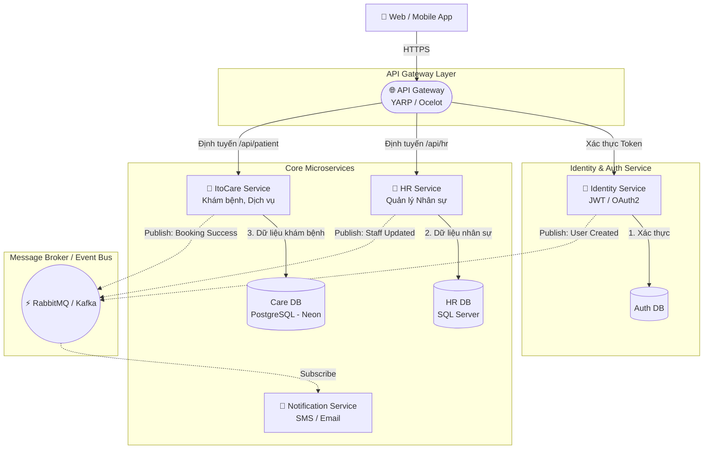

# 🚀 ItoApp - Tầm Nhìn Kiến Trúc Microservices


Tài liệu này phác thảo lộ trình và giải pháp kỹ thuật để chuyển đổi ứng dụng **ItoApp** (Quản lý Nhân Sự & Khám Chữa Bệnh) từ kiến trúc nguyên khối (Monolith) sang kiến trúc **Microservices**.


---

## 1. Sơ Đồ Kiến Trúc Phân Tách

Mô hình áp dụng **API Gateway Pattern** kèm theo **Message Broker** xử lý giao tiếp bất đồng bộ, phù hợp với môi trường ASP.NET Core.



---

## 2. Phân Tách Giới Hạn Nghiệp Vụ (Bounded Contexts)

Thay vì dùng một `ApplicationDbContext` đồ sộ, hệ thống sẽ được chia thành **4 dịch vụ độc lập**, mỗi dịch vụ có mã nguồn và cơ sở dữ liệu riêng:

| Component | Nhiệm Vụ Cốt Lõi | Stack Tham Khảo |
| :--- | :--- | :--- |
| **API Gateway** | Định tuyến yêu cầu, Rate Limiting, CORS, Cân bằng tải. Cổng duy nhất Frontend tiếp xúc. | YARP (Yet Another Reverse Proxy) |
| **Identity Service** | Quản lý Đăng nhập, Phân quyền (Roles), Cấp phát và xác thực JWT/OTP. | ASP.NET Core Identity, Redis |
| **HR Service** | Quản lý Chi nhánh, Khoa phòng, Bằng cấp, Hợp đồng, Lương bác sĩ/nhân viên. | SQL Server, EF Core |
| **ItoCare Service** | Quản lý Bệnh nhân, Danh sách Khám, Dịch vụ, Lịch hẹn, Kết quả xét nghiệm. | PostgreSQL (Neon), EF Core |
| **Notification Service** | Lắng nghe Event (Sự kiện) để tự động gửi SMS OTP, Email báo lịch hẹn. | Twilio, SendGrid, MongoDB |

---

## 3. Cấu Trúc Mã Nguồn Mục Tiêu

Hệ thống vẫn giữ vững nguyên tắc **Clean Architecture**, nhưng áp dụng ở cấp độ từng Microservice độc lập.

```text
📁 APP_HR
 ├── 📁 BuildingBlocks       # (Shared packages, Utils, Jwt Middleware dùng chung)
 │    ├── Core.Shared
 │    └── Core.EventBus      # (Mẫu tin nhắn RabbitMQ)
 │
 ├── 📁 ApiGateways
 │    └── ItoApp.Gateway     # Setup YARP định tuyến request
 │
 └── 📁 Services             # (Mỗi thư mục là một Solution API riêng)
      ├── 📁 Identity
      │    └── Identity.Api / Application / Infrastructure / Domain
      │
      ├── 📁 HR
      │    └── HR.Api / Application / Infrastructure / Domain
      │
      └── 📁 ItoCare
           └── ItoCare.Api / Application / Infrastructure / Domain
```

---

## 4. Giải Quyết Bài Toán JOIN Dữ Liệu Chéo

Khi tách ra, bảng `LichHen` (PostgreSQL) và thông tin `NhanVien` / `Bác sĩ` (SQL Server) nằm trên hai máy chủ khác nhau, **không thể dùng `JOIN` hoặc EF `Include()`**. Các giải pháp:

1. **API Composition Layer:** 
   Frontend (hoặc một lớp Aggregator trung gian) tiến hành gọi 2 request riêng biệt (một tới lưới Lịch hẹn, một tới lưới Bác Sĩ), sau đó C# merge (map) hai danh sách lại dựa trên Id trước khi trả về.
   - *Phù hợp:* Dữ liệu nhỏ, trang tổng quan Dashboard.

2. **Data Duplication (Event-Driven):** 
   Lưu bản sao thông tin quan trọng. Bảng `LichHen` bên ItoCare sẽ lưu luôn `TenBacSi` thay vì chỉ lưu ID. Bất cứ khi nào Bác sĩ đổi tên bên hệ thống HR, `HR Service` bắn Event, `ItoCare Service` bắt Event và tự động cập nhật bảng `LichHen`.
   - *Phù hợp:* Giao dịch siêu lớn, Database cần query nhanh kỷ lục.


3. **gRPC Internal Calls:**
   Dùng gRPC để hai hệ thống hỏi đáp mặt đối mặt nội bộ với nhau trong vài mili-giây thay vì dùng HTTP REST API truyền thống.

---

## 5. Lộ Trình Bước Đi (Dành Cho Team ItoApp)

1. **Giai đoạn 1 (Modular Monolith):** Giữ nguyên ứng dụng như hiện tại, nhưng rạch ròi các thư mục (HR vs ItoCare). Luyện tập việc "Giao tiếp bề mặt" (Interfaces) thay vì chọc thẳng vào Class Database của nhau.
2. **Giai đoạn 2 (Tách Gateway & Auth):** Chuyển toàn bộ Controller Đăng nhập thành 1 Project Identity riêng, cấp JWT chung cho mọi API. Dựng YARP chắn phía trước.
3. **Giai đoạn 3 (Tách Core):** Cầm nguyên Folder `HR` và máy chủ `SQL Server` kéo qua một Container mới. Cầm Folder `ItoCare` qua một Container Postgres mới. Bơm RabbitMQ vào giữa để nối chúng lại. 
